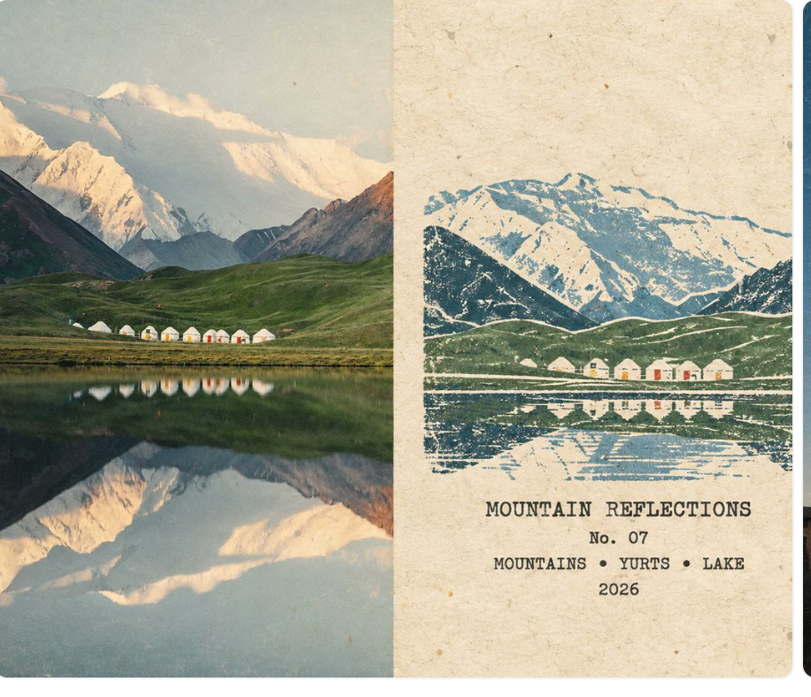
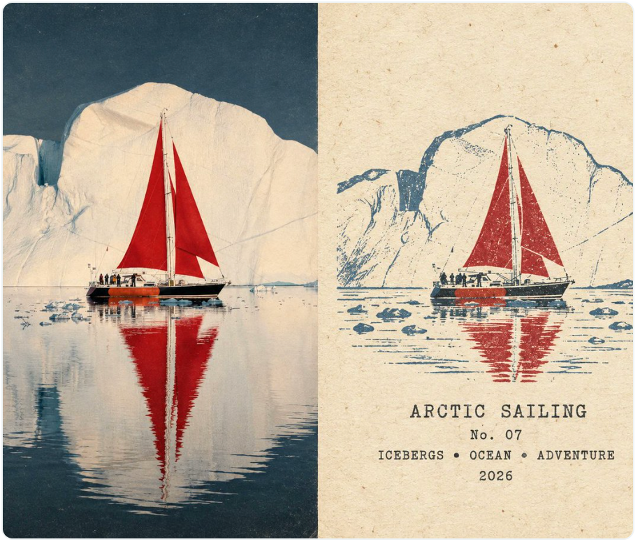

<div align="center">

# 🧳 Photo Rubber-Stamp Journal

**Turn a photograph into a quiet field-journal spread — real scene on the left, hand-stamped memory on the right.**

<p>
  <a href="./README.md">🇬🇧 <b>English</b></a>
  &nbsp; · &nbsp;
  <a href="./README.zh-CN.md">🇨🇳 <b>简体中文</b></a>
  &nbsp; · &nbsp;
  <a href="./README.ja.md">🇯🇵 <b>日本語</b></a>
</p>

<p>
  
  <a href="./LICENSE"></a>
</p>

</div>

---

## 📖 About

**Photo Rubber-Stamp Journal** is a Codex image-generation Skill that turns each uploaded photograph into an independent **4:3 travel-journal poster**.

The composition is split exactly in half:

- **Left — Photograph:** the uploaded scene stays recognizable and photographic.
- **Right — Rubber stamp:** the same scene is distilled into a compact, hand-carved multi-color stamp on aged paper.

The result is meant to feel like a small collectible field-journal spread rather than a generic photo filter or vector illustration.

```text
PHOTO  →  PRESERVE  →  DISTILL  →  STAMP  →  ARCHIVE
```

---

## 🖼️ Examples

<p align="center">
  
  
</p>

<p align="center">
  <sub>Mountain Reflections · Arctic Sailing</sub>
</p>

> These are finished example posters for the public gallery. They are not runtime reference images or style-conditioning assets.

---

## ✨ What It Preserves

- **Photography stays photography.** People, animals, architecture, objects, scenery, pose, orientation, and spatial relationships remain tied to the uploaded source.
- **The stamp becomes a visual memory.** It keeps only the silhouettes, landmarks, horizons, poses, color relationships, and structural cues needed to recognize the same scene.
- **The material stays physical.** Broken contours, dry ink, uneven pressure, pigment grain, paper fibers, and subtle color misregistration create a hand-printed result.

---

## 🚀 Quick Start

### 1. Install

```bash
git clone https://github.com/Beverly621/photo-rubber-stamp-journal-skill.git
mkdir -p ~/.codex/skills
cp -R \
  photo-rubber-stamp-journal-skill/skills/photo-rubber-stamp-journal \
  ~/.codex/skills/
```

Restart Codex if the Skill does not appear immediately.

### 2. Upload a photo

Start a new Codex conversation and attach the photograph you want to transform.

### 3. Run the Skill

```text
Use $photo-rubber-stamp-journal to transform this photo.
```

That's it.

---

## 🏷️ Optional Metadata

You can optionally provide a title, number, or year:

```text
Theme or title: Arctic Sailing
Number: 07
Year: 2026
```

Any missing field is generated automatically.

---

## 🖼️ Multiple Photos

Multiple photographs can be uploaded in one request. Each source photo is treated as its **own independent generation job**.

```text
3 source photos
      ↓
3 independent generations
      ↓
3 finished posters
```

Subjects, locations, colors, people, and objects are kept isolated between images.

---

## 🧩 How the Skill Is Built

The runtime architecture stays intentionally small:

```text
SKILL.md
   ↓
generation-prompt.md
   ↓
image generation
   ↓
quality-gate.md
   ↓
finished poster
```

- `SKILL.md` — workflow and photo isolation
- `references/generation-prompt.md` — canonical production prompt
- `references/quality-gate.md` — post-generation visual inspection
- `evals/evals.json` — regression cases for important behaviors

The production prompt remains the single source of truth for the visual style.

---

## 📁 Repository Structure

```text
photo-rubber-stamp-journal-skill/
├── README.md
├── README.zh-CN.md
├── README.ja.md
├── LICENSE
├── examples/
│   ├── mountain-reflections.png
│   └── arctic-sailing.png
├── evals/
│   └── evals.json
└── skills/
    └── photo-rubber-stamp-journal/
        ├── SKILL.md
        ├── agents/
        │   └── openai.yaml
        └── references/
            ├── generation-prompt.md
            └── quality-gate.md
```

---

## 📄 License

Released under the [MIT License](./LICENSE).

The Skill, production prompt, quality gate, evals, and related repository materials may be used, modified, and redistributed under the terms of the MIT License.

---

<div align="center">

**A real scene on the left. A memory in ink on the right.**

📷 → 🪵 → 🖋️ → 📖

</div>
