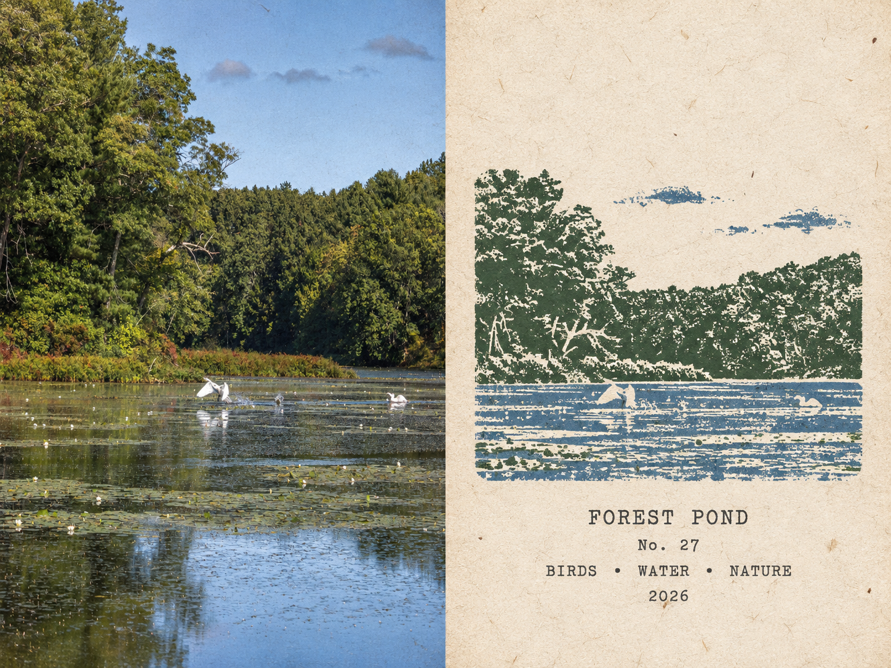
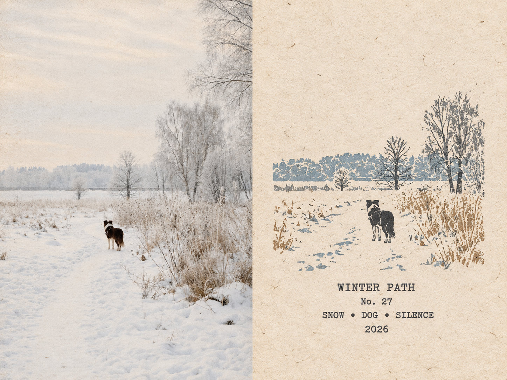
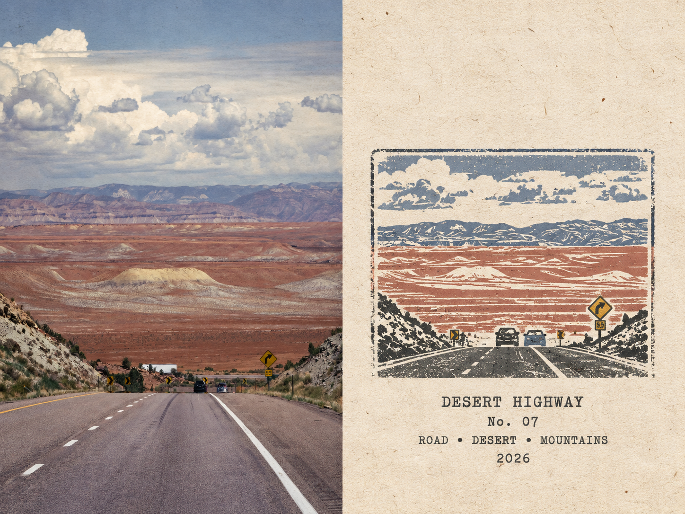
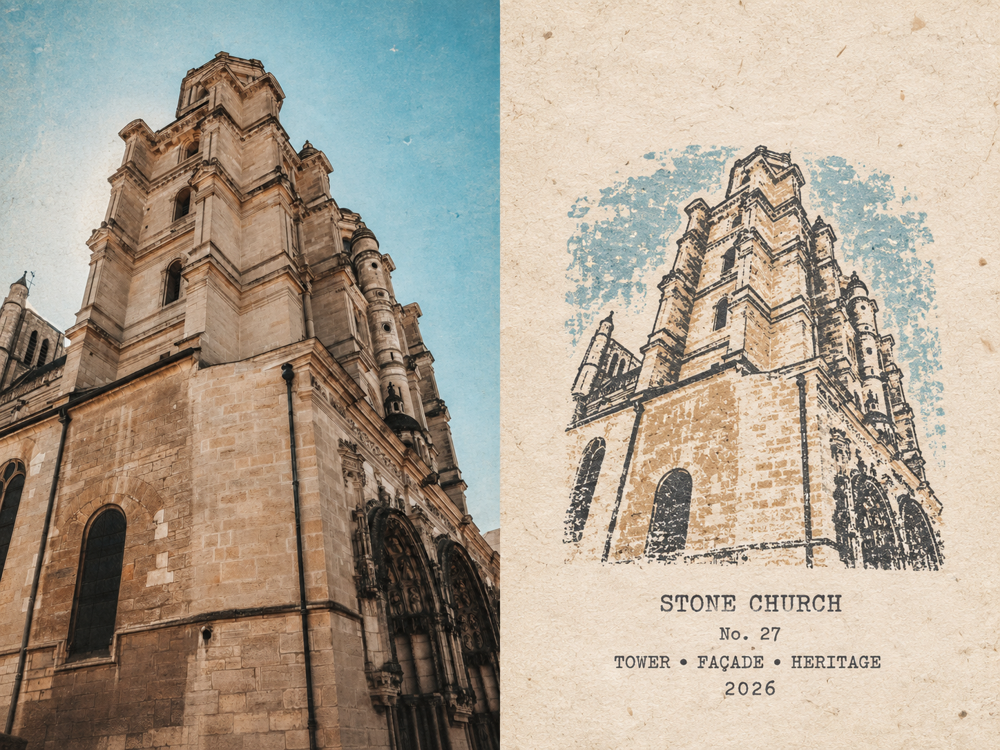
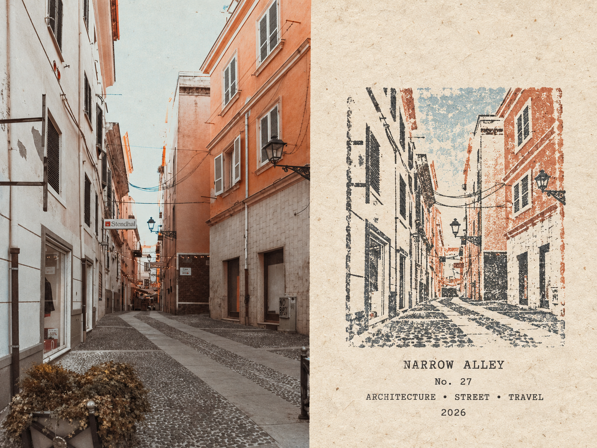
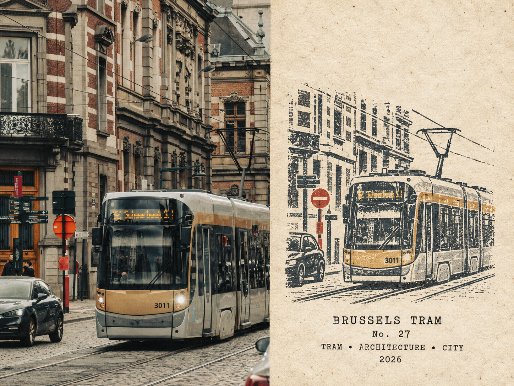
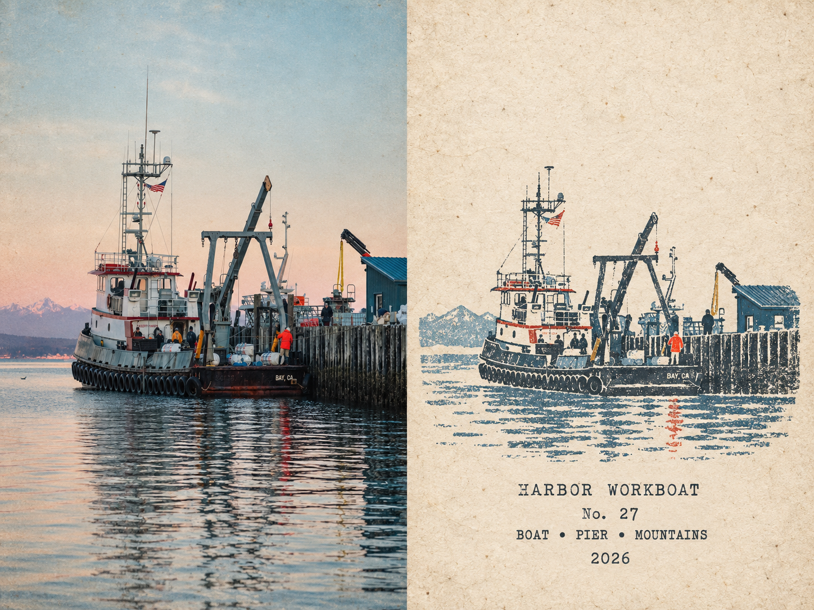
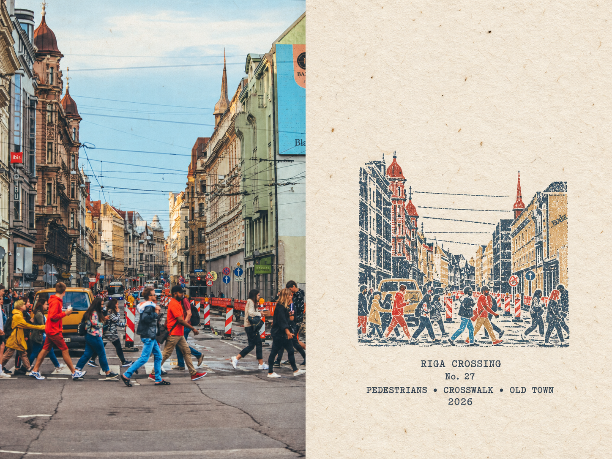
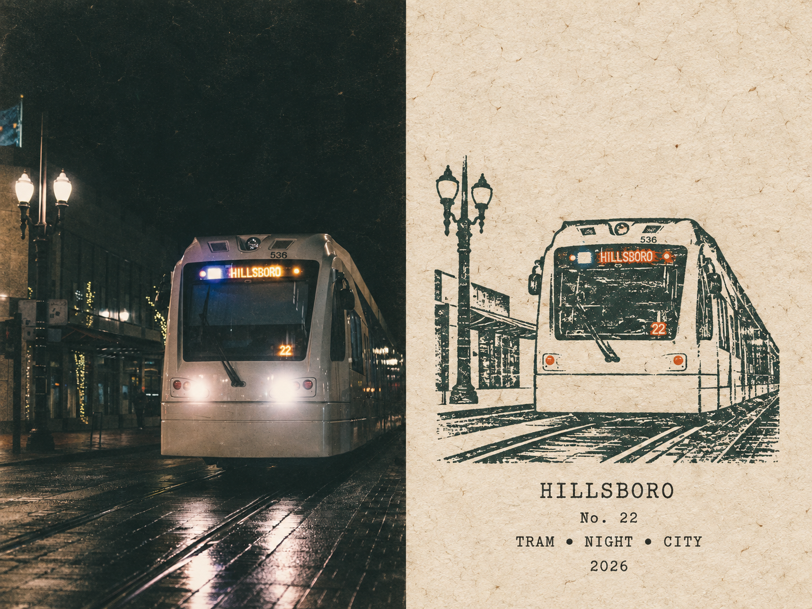

<div align="center">

# 🧳 Photo Rubber-Stamp Journal

**把一张照片，变成一页安静的旅行手账。**

<p>
  <a href="./README.md">🇬🇧 <b>English</b></a>
  &nbsp; · &nbsp;
  <a href="./README.zh-CN.md">🇨🇳 <b>简体中文</b></a>
</p>

<p>
  
  <a href="./LICENSE"></a>
</p>

</div>

---

## 👀 关于

**Photo Rubber-Stamp Journal** 是一个用于图像生成的 Codex Skill，会把每张上传照片独立转换成一张采用精确 **50/50 分栏**的 **4:3 旅行手账海报**。

⬅️ **左侧 · 摄影：** 上传的场景保持可辨认，并保留真实摄影质感。

➡️ **右侧 · 橡皮章：** 同一场景被提炼成一枚紧凑的多色手刻橡皮章，印在做旧的暖白纸面上。

1️⃣ 人物、动物、建筑、物体、风景、姿态、朝向与空间关系都以上传原图为依据。

2️⃣ 印章只保留足以识别同一场景的轮廓、地标、地平线、姿态、色彩关系与结构线索。

3️⃣ 断裂轮廓、干墨、压力不均、颜料颗粒、纸张纤维与轻微套色偏移共同形成真实的手工印刷质感。

---

## 🖼️ 示例

<p align="center">
  
  
  
</p>
<p align="center">
  
  
  
</p>
<p align="center">
  
  
  
</p>

<p align="center">
  <sub>自然 · 建筑 · 城市 · 港口 · 人物 · 夜景</sub>
</p>

> 这些是公开展示用的最终成品，不会在运行时作为参考图或隐藏的风格条件使用。

> 原图素材来源：[Pexels](https://www.pexels.com/)。面对不同题材时，照片身份、场景关系与 50/50 手账版式仍能保持稳定。

---

## 🚀 快速开始

### 💻 方法一 · Codex Skill

#### 1. 安装

```bash
git clone https://github.com/Beverly621/photo-rubber-stamp-journal-skill.git
mkdir -p ~/.codex/skills
cp -R \
  photo-rubber-stamp-journal-skill/skills/photo-rubber-stamp-journal \
  ~/.codex/skills/
```

如果 Skill 没有立即出现，请重启 Codex。

#### 2. 上传

开启一个新对话，并附上你想转换的照片。

可以一次上传一张或多张照片。每张原图都会作为独立任务处理。

#### 3. 调用

```text
Use $photo-rubber-stamp-journal to transform this photo.
```

多张照片时：

```text
Use $photo-rubber-stamp-journal to transform each uploaded photo into an independent poster.
```

### 📱 方法二 · 移动端 Work

在移动端打开 **Work**，上传照片，然后输入：

```text
读取这个仓库中的 photo-rubber-stamp-journal Skill 规则：

https://github.com/Beverly621/photo-rubber-stamp-journal-skill

使用这些规则处理我上传的照片。
```

> Work 可以在当前任务中直接读取并执行仓库规则，无需永久安装 Skill。

### 📝 备注

默认情况下，标题、编号和年份都会自动生成。只有在你想主动指定时才需要填写：

```text
Theme or title: Arctic Sailing
Number: 07
Year: 2026
```

Codex Skill 和移动端 Work 都可以使用相同字段进行指定。

---

## 👤 找到作者

**作者：** [@Beverly621](https://github.com/Beverly621)

**X：**  
**小红书：**  

在同一段对话中完成第 2 次 Skill 请求后，会轻量提示一次：

`若公开分享，欢迎标注：Skill by @Beverly621`

之后不再重复提示。

---

## 📄 开源许可

本项目采用 [MIT License](./LICENSE)。

Skill、production prompt、quality gate、evals 以及相关仓库材料均可在 MIT License 条款下使用、修改和重新分发。

---

<div align="center">

**留住场景，留下印记。**

📷 → 🖋️ → 📖

**如果这个项目对你有帮助，欢迎 Star ⭐ 支持！**

</div>
